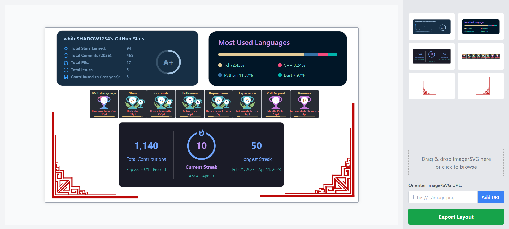

# Profile Board GitHub Action 🧩


**Tired of juggling multiple Markdown image links for your GitHub stats, trophies, and custom SVGs on your profile README?**

This GitHub Action automatically composes multiple SVGs and images (from URLs or local files) into a single, sleek SVG based on coordinates you define in a layout file. Keep your profile README clean and your visuals perfectly arranged! ✨



[Rendered link for the generated SVG using this GitHub Action](https://www.svgviewer.dev/s/zuCi5j1p)

## 🤔 Why Use This Action?

*   **🎨 Visual Design First:** Use the companion **[Profile Board Website](https://github.com/whiteSHADOW1234/Profile-Board)** to visually design your layout, then simply copy the generated JSON.
*   **🖼️ Unified Visuals:** Combine dynamic elements like GitHub stats, top languages, streak stats, trophies, and your own custom SVGs/images into one cohesive image.
*   **📐 Precise Layout Control:** Define exact X/Y coordinates and dimensions for each element in a simple JSON layout (generated by the website or created manually).
*   **🧹 Cleaner READMEs:** Replace multiple Markdown image links with just one, making your profile source code much tidier.
*   **🔄 Automatic Updates:** Run this action on a schedule or on push events (e.g., when local assets change) to keep your composed SVG up-to-date automatically.
*   **🔗 Flexible Sources:** Fetch images directly from URLs (like Vercel-hosted stats cards) or use SVG/image files directly from your repository.
*   **🚀 Easy Integration:** Set up quickly within your existing GitHub Actions workflows.

## ✨ Features

*   **Visual Layout Designer:** Design your board visually using the **[Profile Board Website](https://profile-board.vercel.app/)** and export the JSON configuration.
*   Combines remote images (PNG, JPG, GIF, SVG via URL) and local SVG/image files.
*   Uses a JSON array to define the layout (source, position, size).
*   Automatically calculates the bounding box for the final SVG.
*   Optionally commits the generated SVG back to your repository.
*   Configurable file matching for local assets.

## 🚀 Usage

1.  **(Recommended) Design Your Layout:**
    *   Go to the **[Profile Board Website](https://profile-board.vercel.app/)**. 
    *   Visually arrange your desired stats cards, trophies, images, and SVGs.
    *   Once satisfied, **copy the generated JSON layout data**.

2.  **Set up the GitHub Action:**
    *   Create a workflow file (e.g., `.github/workflows/profile-board.yml`).
    *   Paste the following workflow configuration, adapting it as needed.

```yaml
name: Update Profile Board SVG

on:
  schedule:
    # Runs every 6 hours - adjust as needed
    - cron: '0 */6 * * *'
  workflow_dispatch: # Allow manual triggering
  push:
    branches: [ main ]
    paths:
      # Trigger if local assets or layout definition change
      - 'images/**'        # Adjust if your local assets are elsewhere
      - 'layout.json'      # Trigger if you use a layout file

jobs:
  merge-svg:
    runs-on: ubuntu-latest
    permissions:
      contents: write # Crucial: Allows the action to push the generated SVG

    steps:
      - name: Checkout repository
        uses: actions/checkout@v4

      - name: Generate Profile Board SVG
        uses: whiteSHADOW1234/profileBoard@v1 # Use the latest release tag
        id: merge # Give the step an ID
        with:
          # Provide the layout JSON copied from the Profile Board Website:

          # Option 1: Inline JSON (Good for simple layouts or quick tests)
          # layout: |
          #   [ { "id": "...", "url": "...", ... }, ... ] # Paste your JSON here

          # Option 2: Reference a layout file (Recommended)
          #   a. Save the copied JSON into a file named 'layout.json' in your repo root.
          #   b. Use the following input:
          layout: ${{ toJSON(fromJSON(readFile('layout.json'))) }}

          # --- Other Inputs ---
          assets: "images/*.svg,images/*.png" # Glob patterns for local files (adjust path if needed)
          token: ${{ secrets.GITHUB_TOKEN }} # Use the default GitHub token
          # output_path: 'profile-board.svg' # Optional: Specify output file path (if the action supports it, otherwise check default)

      # Important: Commit the generated SVG file
      - name: Commit generated SVG
        run: |
          git config --global user.name 'github-actions[bot]'
          git config --global user.email 'github-actions[bot]@users.noreply.github.com'
          # --- IMPORTANT: CHANGE 'output.svg' if your action saves to a different file ---
          # --- Or use the 'output_path' value if you specified one above ---
          git add output.svg 
          # Check if there are changes to commit
          if git diff --staged --quiet; then
            echo "No changes to commit."
          else
            git commit -m "chore: Update profile board SVG [skip ci]"
            git push
          fi
        # Only run commit step if the merge step succeeded
        if: steps.merge.outcome == 'success'

```

# ⚙️ Inputs

| Input         | Description                                                                                                 | Required | Default               |
| ------------- | ----------------------------------------------------------------------------------------------------------- | -------- | --------------------- |
| `layout`      | JSON array defining items, their sources (URL or local path), and layout. Can be generated via the website. | `true`   |                       |
| `assets`      | Comma-separated list of file glob patterns for local assets                                                 | `false`  | `images/*.svg`        |
| `token`       | GitHub token for committing changes back to the repository                                                  | `true`   | `${{ github.token }}` |

# 📐 Layout JSON Structure
The layout input must be a JSON string representing an array of objects. You can generate this structure easily using the [Profile Board Website](https://github.com/whiteSHADOW1234/Profile-Board) or create it manually.

Each object defines an item to be placed on the SVG canvas:
```
[
  {
    "id": "unique-identifier-1", // A unique string ID for this item
    "url": "https://some-url.com/image.png", // URL for remote images OR path for local files (e.g., "images/my-icon.svg")
    "type": "image", // "image" for remote URLs (png, jpg, gif, svg) or local raster images, "svg" for local SVG files to be embedded directly
    "x": 10,         // X-coordinate (top-left corner)
    "y": 20,         // Y-coordinate (top-left corner)
    "width": 300,    // Desired width of the item
    "height": 150    // Desired height of the item
  },
  {
    "id": "local-svg-icon",
    "url": "images/LeftCorner.svg", // Path relative to the repository root
    "type": "svg", // Embeds the SVG content directly
    "x": 50,
    "y": 180,
    "width": 100,
    "height": 100
  }
  // ... more items
]
```
- `id`: A unique identifier for the element (useful for debugging, could be used for future features).
- `url`: The source of the image or SVG. Can be an absolute HTTPS URL or a path relative to the repository root (matching the `assets` input).
- `type`:
  - `image`: Treats the source as an image. Fetches remote URLs or reads local image files and embeds them using an `<image>` tag. Handles PNG, JPG, GIF, and even remote SVGs this way.
  - `svg`: Treats the source as a local SVG file. Reads the file content and embeds it directly into the main SVG structure. This is best for local vector graphics.
- `x`, `y`: The coordinates for the top-left corner of the item within the final SVG canvas. Negative values are allowed.
- `width`, `height`: The dimensions the item should have in the final SVG.

# 🤝 Contributing
Contributions are welcome! If you have ideas for improvements or find a bug, please:

1. Fork the repository.
2. Create a new branch (git checkout -b feature/your-feature-name).
3. Make your changes.
4. Commit your changes (git commit -am 'Add some feature').
5. Push to the branch (git push origin feature/your-feature-name).
6. Open a Pull Request.

Please ensure your code follows the existing style and add tests if applicable.

# 📜 License
This project is licensed under the MIT License - see the LICENSE file for details.
