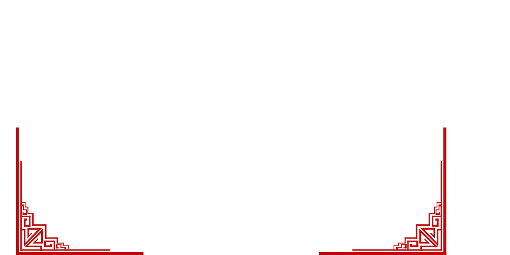

# SVG Layout Composer Action

A GitHub Action that composes SVG elements and images into a single SVG based on layout coordinates. Perfect for creating dynamic README profile images, dashboards, or any composite SVG graphics.

## Features

- 🔄 **Dynamic Composition**: Combine multiple SVGs and images into a single file based on precise layout coordinates
- 🌐 **Remote & Local Assets**: Fetch SVGs/images from URLs or use files from your repository
- 🔍 **SVG Optimization**: Automatically optimize the final SVG using SVGO
- 🤖 **Fully Automated**: Auto-commits and pushes the generated SVG to your repository

## Usage

### Basic Setup

1. Create a `layout.json` file with [Profile-Board](https://github.com/whiteSHADOW1234/Profile-Board) in your repository with your desired layout:

```json
[
  {
    "id": "header",
    "url": "blob:header.svg",
    "type": "svg",
    "x": 0,
    "y": 0,
    "width": 800,
    "height": 200
  },
  {
    "id": "avatar",
    "url": "https://github.com/yourusername.png",
    "type": "image",
    "x": 50,
    "y": 50,
    "width": 100,
    "height": 100
  }
]
```

2. Create a workflow file (e.g., `.github/workflows/update-svg.yml`):

```yaml
name: Update Profile SVG

on:
  push:
    branches: [ main ]
    paths:
      - 'images/**'
      - 'layout.json'
  schedule:
    - cron: '0 0 * * *'  # Update daily
  workflow_dispatch:  # Allow manual triggering

jobs:
  update-svg:
    runs-on: ubuntu-latest
    permissions:
      contents: write  # Needed to push changes

    steps:
      - name: Checkout repository
        uses: actions/checkout@v4
      
      - name: Compose SVG Layout
        uses: yourusername/svg-layout-composer-action@v1
        with:
          layout: ${{ cat layout.json }}
          assets: "images/*.svg,images/*.png"
          token: ${{ secrets.GITHUB_TOKEN }}
```

3. Add your SVG assets to the `images/` directory in your repository.

4. The action will generate a `README.svg` file in your repository root.

### Inputs

| Name | Description | Required | Default |
|------|-------------|----------|---------|
| `layout` | JSON array of items with coordinates and source URLs | Yes | - |
| `assets` | Comma-separated list of file glob patterns | No | `images/*.svg` |
| `token` | GitHub token for committing changes | Yes | `${{ github.token }}` |

### Layout Item Format

Each item in your layout should follow this format:

```json
{
  "id": "unique-identifier",
  "url": "source-url-or-path",
  "type": "svg|image|png|jpg|jpeg|gif",
  "x": 0,
  "y": 0,
  "width": 100,
  "height": 100
}
```

- **`id`**: Unique identifier for the item
- **`url`**: Source URL or path
  - Remote URLs: starting with `http://` or `https://`
  - Local files: starting with `blob:` followed by the relative path under `images/`
- **`type`**: Type of content
  - `svg`: SVG content
  - `image` or specific formats like `png`, `jpg`: Image content
- **`x`**, **`y`**: Position coordinates
- **`width`**, **`height`**: Dimensions

## Examples

### Dynamic GitHub Profile

Create a dynamic profile README by combining statistics, badges, and custom graphics:

```json
[
  {
    "id": "header",
    "url": "blob:header.svg",
    "type": "svg",
    "x": 0,
    "y": 0,
    "width": 800,
    "height": 200
  },
  {
    "id": "avatar",
    "url": "https://github.com/yourusername.png",
    "type": "image",
    "x": 50,
    "y": 50,
    "width": 100,
    "height": 100
  },
  {
    "id": "github-stats",
    "url": "https://github-readme-stats.vercel.app/api?username=yourusername&show_icons=true&theme=radical",
    "type": "svg",
    "x": 200,
    "y": 250,
    "width": 400,
    "height": 200
  },
  {
    "id": "top-languages",
    "url": "https://github-readme-stats.vercel.app/api/top-langs/?username=yourusername&layout=compact&theme=radical",
    "type": "svg",
    "x": 200,
    "y": 475,
    "width": 400,
    "height": 200
  },
  {
    "id": "footer",
    "url": "blob:footer.svg",
    "type": "svg",
    "x": 0,
    "y": 700,
    "width": 800,
    "height": 100
  }
]
```

### Project Dashboard

Create a status dashboard for your project:

```json
[
  {
    "id": "logo",
    "url": "blob:project-logo.svg",
    "type": "svg",
    "x": 0,
    "y": 0,
    "width": 200,
    "height": 200
  },
  {
    "id": "build-status",
    "url": "https://github.com/yourusername/yourrepo/workflows/Build/badge.svg",
    "type": "svg",
    "x": 250,
    "y": 50,
    "width": 150,
    "height": 30
  },
  {
    "id": "coverage",
    "url": "https://codecov.io/gh/yourusername/yourrepo/graph/badge.svg",
    "type": "svg",
    "x": 250,
    "y": 100,
    "width": 150,
    "height": 30
  },
  {
    "id": "chart",
    "url": "blob:performance-chart.svg",
    "type": "svg",
    "x": 0,
    "y": 250,
    "width": 600,
    "height": 300
  }
]
```

## Displaying the Result in Your README.md

To display the generated SVG in your README.md file, add the following line:

```markdown

```

For GitHub profiles, use:

```markdown

```

## Advanced Features

### Dynamic Updating

You can set up your workflow to update the SVG:

- On push to the repository
- On a schedule using cron
- When specific paths change
- Manually via workflow dispatch

### SVG Optimization Options

The action uses SVGO to optimize the final SVG. The default configuration preserves layout-critical attributes like viewBox while removing unnecessary elements.

## Troubleshooting

### SVG Not Displaying Correctly

- Check your layout coordinates and dimensions
- Verify that source SVGs have proper viewBox attributes
- Inspect the generated SVG for errors

### Action Failing

- Ensure all remote URLs are accessible
- Check that local files exist in the specified paths
- Verify GitHub Actions has write permissions for your repository

## License

MIT License - see the LICENSE file for details.